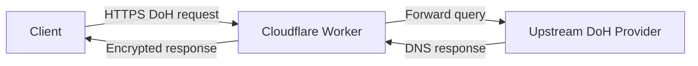
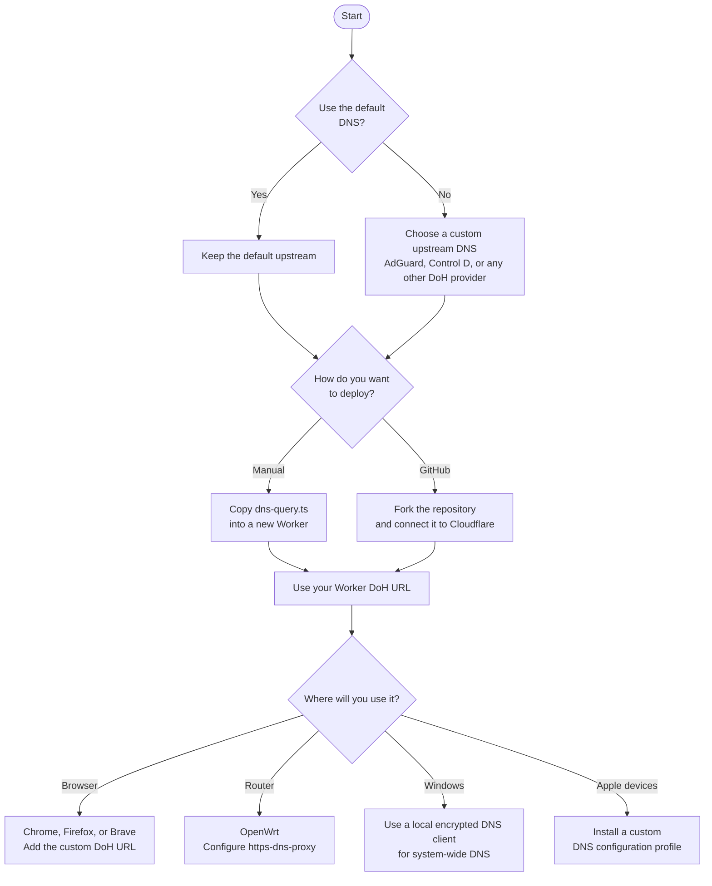

#  DoH-CFW (DNS over HTTPS Cloudflare Worker)

A lightweight DNS over HTTPS (DoH) proxy running on Cloudflare’s edge network. It forwards DNS queries to **Control D** by default and supports any compatible DoH provider.

The project is designed for users who want encrypted DNS when public DoH endpoints are blocked or unreliable.

## Why This Project Exists

Some networks block the public hostnames of well-known DoH providers. In these cases, configuring a public resolver directly is not enough.

DoH-CFW places the upstream resolver behind a Cloudflare Worker. Clients connect to the Worker over HTTPS, and the Worker forwards the query to the chosen upstream provider. A custom domain can also be attached if the default `workers.dev` hostname becomes blocked.

This does not guarantee access on every network. Filtering systems may still block Cloudflare IP ranges, TLS fingerprints, or custom domains. The goal is to provide a practical, user-controlled fallback.

## Features

- **Edge caching** — Uses Cloudflare’s `caches.default` for repeated queries.
- **Non-blocking** — Background tasks (cache writes) run with `ctx.waitUntil`.
- **Streaming** — `POST` bodies are forwarded without full buffering.
- **Path protection** — Requests outside the configured path are rejected.
- **Configurable upstream** — Defaults to Control D Family; any standard DoH endpoint can be used.
- **CORS support** — Handles `OPTIONS` preflight requests.

## Architecture Overview



**Flow:**
1. The client sends a standard DoH request (`GET` or `POST`) to the Worker.
2. The Worker validates the path and optionally serves the response from edge cache.
3. If not cached, the Worker forwards the request to the configured upstream DoH endpoint.
4. The upstream response is returned to the client. Successful `GET` responses are stored in the edge cache for a short period.

The Worker itself does not resolve DNS records. It only proxies the encrypted query and response.

## Overview

- [Features](#features)
- [Architecture Overview](#architecture-overview)
- [Choosing an Upstream DNS Provider](#choosing-an-upstream-dns-provider)
- [Deployment and Usage](#-deployment-and-usage)
  - [Option 1: Deploy the code manually](#option-1-deploy-the-code-manually)
  - [Option 2: Fork the repository and deploy from GitHub](#option-2-fork-the-repository-and-deploy-from-github)
- [Configuring Clients](#configuring-clients)
  - [Chrome](#-chrome)
  - [Firefox](#-firefox)
  - [Brave](#-brave)
  - [OpenWrt](#-openwrt)
  - [Windows 11](#windows-11)
  - [macOS, iPhone, and iPad](#macos-iphone-and-ipad)
- [Limitations and Security Considerations](#limitations-and-security-considerations)

## Quick Configuration Guide



---

## Choosing an Upstream DNS Provider

By default this project uses **Control D Family**:

```ts
const UPSTREAM_DOH_ENDPOINT = "https://freedns.controld.com/family";
```

According to Control D, this filter blocks malware, ads, trackers, adult content, and drug-related sites. It is suitable for kids’ devices or shared home networks.

To use a different resolver, change the value of `UPSTREAM_DOH_ENDPOINT` in `functions/dns-query.ts`.

Google Public DNS and Cloudflare’s standard public resolver are plain DNS services and do not perform special filtering. Prefer a filtering resolver when ad/tracker/malware blocking matters.

### Control D Free Resolvers

| Filter | Description | Endpoint |
|--------|-------------|----------|
| **Malware Protection** | Blocks known dangerous sites | `https://freedns.controld.com/p1` |
| **Ads & Tracking** | Blocks malware, ads, and trackers | `https://freedns.controld.com/p2` |
| **Social** | Blocks major social media sites | `https://freedns.controld.com/p3` |
| **Family** (default) | Blocks malware, ads, trackers, adult content, and drug-related sites | `https://freedns.controld.com/family` |

### AdGuard Free Resolvers

| Filter | Description | Endpoint |
|--------|-------------|----------|
| **Default** | Blocks ads and trackers | `https://dns.adguard-dns.com/dns-query` |
| **Non-filtering** | No blocking | `https://unfiltered.adguard-dns.com/dns-query` |
| **Family protection** | Blocks ads, trackers, adult content + Safe Search | `https://family.adguard-dns.com/dns-query` |

**Note:** In testing, AdGuard DNS did not block ads and malware as completely as expected.

### More providers

A larger list of public DNS-over-HTTPS providers is available here:  
[https://adguard-dns.io/kb/general/dns-providers/](https://adguard-dns.io/kb/general/dns-providers/)

<sub>Before choosing an upstream resolver, review its privacy policy. This project encrypts the connection between the client and Cloudflare, but the upstream DNS provider still receives and resolves the actual queries.</sub>

---

##  Deployment and Usage

### Option 1: Deploy the code manually

1. Open [`functions/dns-query.ts`](https://github.com/SinaMombeiny/DoH-CFW/blob/main/functions/dns-query.ts) and copy the code.
2. In the [Cloudflare Dashboard](https://dash.cloudflare.com/), go to **Workers & Pages**.
3. Create a new Worker and replace the default code with the contents of `dns-query.ts`.
4. Deploy.

The DoH endpoint will look like:

```text
https://<worker-name>.<account-subdomain>.workers.dev/dns-query
```

### Option 2: Fork the repository and deploy from GitHub

1. Fork the [DoH-CFW repository](https://github.com/SinaMombeiny/DoH-CFW).
2. In **Workers & Pages**, create a new application and import the forked repository.
3. Deploy.

Future pushes to the connected branch can trigger automatic redeployments.

---

## Configuring Clients

Replace the placeholder below with your deployed Worker URL:

```text
https://<worker-name>.<account-subdomain>.workers.dev/dns-query
```

###  Chrome

1. Open **Settings** → **Privacy and security** → **Security**.
2. Enable **Use secure DNS**.
3. Select the custom provider and paste your Worker URL.

###  Firefox

1. Open **Settings** → **Privacy & Security**.
2. Under **DNS over HTTPS**, choose **Custom Protection** (or **Max Protection**).
3. Enter your Worker URL.

###  Brave

1. Open **Settings** → **Privacy and security** → **Security**.
2. Enable **Use secure DNS** → **With Custom** and paste your Worker URL.

> Browser-level DoH only affects traffic from that browser. It does not change system or other application DNS.

###  OpenWrt

Install `https-dns-proxy`:

```sh
opkg update
opkg install https-dns-proxy luci-app-https-dns-proxy
```

Configure the resolver URL in **Services** → **HTTPS DNS Proxy**, or via CLI:

```sh
while uci -q delete https-dns-proxy.@https-dns-proxy[0]; do :; done
uci set https-dns-proxy.doh="https-dns-proxy"
uci set https-dns-proxy.doh.bootstrap_dns="76.76.2.2,94.140.14.14"
uci set https-dns-proxy.doh.resolver_url="https://<worker-name>.<account-subdomain>.workers.dev/dns-query"
uci set https-dns-proxy.doh.listen_addr="127.0.0.1"
uci set https-dns-proxy.doh.listen_port="5053"
uci commit https-dns-proxy
service https-dns-proxy restart
```

### Windows 11

Windows native DoH requires a fixed DNS server IP. A `workers.dev` endpoint does not provide one, so native configuration is not recommended.

For system-wide use, run a local client such as [dnscrypt-proxy](https://github.com/DNSCrypt/dnscrypt-proxy):
1. Configure your Worker URL as the only upstream.
2. Bind it to `127.0.0.1` / `::1`.
3. Point the Windows network adapter to the local proxy only.

### macOS, iPhone, and iPad

Use a configuration profile containing your Worker URL. Tools such as [Senki’s DNS profile generator](https://dns.senkl.eu/tool.html) can create the `.mobileconfig` file.

Install the profile only after verifying that it contains exactly your intended DoH endpoint.

---

## Limitations and Security Considerations

- **This is a proxy, not a resolver.** The Worker does not perform DNS resolution itself. All queries are forwarded to the configured upstream provider.
- **Upstream visibility.** The upstream DNS provider (Control D, AdGuard, etc.) still sees the domain names being queried. Encrypting the path to Cloudflare does not hide queries from the upstream.
- **Cloudflare visibility.** Cloudflare can see the client IP and the fact that a DoH request was made to your Worker. The query content itself is encrypted between the client and the Worker, and again between the Worker and the upstream.
- **No strong anonymity.** This project improves encryption and can help bypass simple hostname blocking. It is not designed for strong anonymity or censorship resistance against sophisticated adversaries.
- **Caching.** Successful `GET` responses may be cached at the edge for a short time. This improves performance but means identical queries from different clients can be served from cache.
- **Path protection is basic.** The custom path reduces casual scanning, but it is not a security boundary. Anyone who discovers the full URL can still use the endpoint.
- **Custom domains.** Attaching a custom domain can improve reachability, but the domain itself may also be blocked.

Always review the privacy policy of the upstream DNS provider you choose.

---

> *Why did I create this project?*  
> Because I needed a simple, self-hosted DoH proxy that I could control. This is the configuration I use daily.

Suggestions and improvements are welcome via Issues, Discussions, or Pull Requests.
