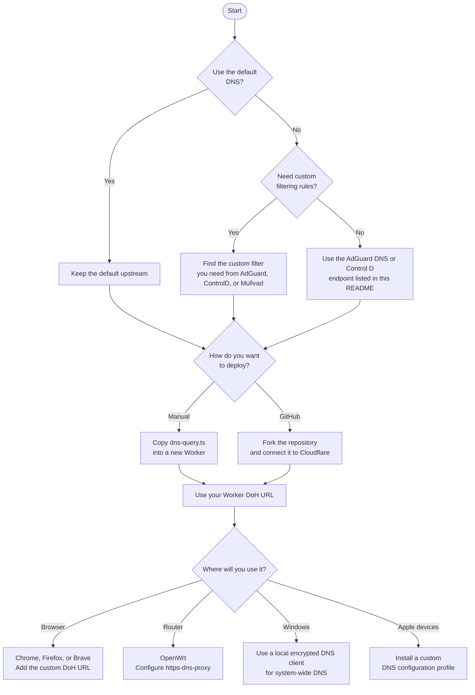

#  DoH-CFW (DNS over HTTPS Cloudflare Worker)

A lightweight and modern DNS over HTTPS (DoH) proxy built for Cloudflare’s global edge network. It forwards DNS queries to **Mullvad Privacy DNS** by default, while allowing the use of any compatible DoH provider.

The project is intended for users who prefer encrypted DNS traffic over conventional local or ISP-provided resolvers. By carrying DNS requests over HTTPS, it can help reduce exposure to ordinary DNS filtering and monitoring at the network level.

## Why This Project Exists

Some ISPs and network-level filtering systems block the public hostnames used by well-known DNS-over-HTTPS providers. In these cases, simply configuring a public DoH resolver in a browser or operating system may not be sufficient, even though the DNS query itself is encrypted.

DoH-CFW provides an alternative by placing the selected resolver behind a Cloudflare Worker. Clients connect to the Worker through HTTPS, while the Worker forwards the DNS query to the configured upstream provider. If the default `workers.dev` hostname is blocked or becomes unreliable, Cloudflare allows the Worker to be attached to a custom domain. This makes it possible to change the hostname used by clients without changing the proxy logic or the chosen upstream resolver.

This does not guarantee access on every network: a filtering system may still block IP ranges, TLS traffic, or a custom domain. The purpose of this project is to provide a practical and user-controlled fallback when public DoH endpoints are not directly reachable.

## Features

- **Low-latency responses:** Uses Cloudflare’s `caches.default` engine to serve repeated DNS queries from a nearby edge location when possible.
- **Lightweight architecture:** Written in pure TypeScript with non-blocking execution through `ctx.waitUntil`.
- **Encrypted DNS transport:** Sends DNS queries over standard HTTPS rather than traditional DNS ports.
- **Streaming requests:** Forwards `POST` request bodies directly without unnecessary memory buffering.
- **Configurable upstream resolver:** Uses Mullvad Privacy DNS by default, but supports any standard DNS-over-HTTPS endpoint.


## Overview

- [Choosing an Upstream DNS Provider](#choosing-an-upstream-dns-provider)
- [Deployment and Usage](#-deployment-and-usage)
  - [Option 1: Deploy the code manually](#option-1-deploy-the-code-manually)
  - [Option 2: Fork the repository and deploy from GitHub](#option-2-fork-the-repository-and-deploy-from-github)
- [Configuring Clients](#configuring-clients)
  - [Chrome](#-chrome)
  - [Firefox](#-firefox)
  - [Brave](#-brave)
  - [OpenWrt](#-openwrt)
  - [Windows 11](#windows-11)
  - [macOS, iPhone, and iPad](#macos-iphone-and-ipad)


## Quick Configuration Guide



---
## Choosing an Upstream DNS Provider

The Worker uses Mullvad Privacy DNS by default. If you prefer another DNS provider, change this line in `functions/dns-query.ts`:

```ts
const UPSTREAM_DOH_ENDPOINT = "https://family.dns.mullvad.net/dns-query";
```

Replace it with the DNS-over-HTTPS endpoint of your preferred provider. The selected resolver must support the standard DoH protocol.

If ad blocking, tracker blocking, and malware protection are important to you, I do not recommend using Google Public DNS or Cloudflare’s standard public resolver for this purpose. Their primary role is fast and reliable DNS resolution; they are not designed to comprehensively filter advertising, trackers, and malicious domains.

For a privacy-conscious setup with filtering, I recommend the following DNS-over-HTTPS endpoints:

### AdGuard DNS

```ts
const UPSTREAM_DOH_ENDPOINT = "https://dns.adguard-dns.com/dns-query";
```

### Control D

```ts
const UPSTREAM_DOH_ENDPOINT = "https://freedns.controld.com/p2";
```

Both options are suitable for users who want an additional filtering layer without changing the Worker’s core logic.

### Custom DNS Profiles

If you need more control over filtering categories, security policies, family-safe rules, or custom blocklists, you can generate a DNS endpoint based on your own requirements through these services:

- [AdGuard DNS — Public DNS](https://adguard-dns.io/en/public-dns.html)
- [Control D — Free DNS](https://controld.com/free-dns)
- [Mullvad — DNS over HTTPS and DNS over TLS](https://mullvad.net/en/help/dns-over-https-and-dns-over-tls)

Before selecting an upstream resolver, review its privacy policy and filtering documentation. While this Worker encrypts the connection between the client and Cloudflare, the upstream DNS provider still receives and resolves DNS queries.


---

##  Deployment and Usage

There are two practical ways to deploy this project on Cloudflare Workers.

### Option 1: Deploy the code manually

This is the simplest method if you only need the DNS proxy and do not want to manage a GitHub repository.

1. Open [`functions/dns-query.ts`](https://github.com/SinaMombeiny/DoH-CFW/blob/main/functions/dns-query.ts) and copy the code.
2. Sign in to the [Cloudflare Dashboard](https://dash.cloudflare.com/), then open **Workers & Pages**.
3. Select **Create application** and create a new Worker from a Worker starter template.
4. Open the Worker editor and replace the default code with the contents of `dns-query.ts`.
5. Select **Deploy**.

After deployment, Cloudflare provides a public Worker address. In this project, the DoH endpoint follows this format:

```text
https://<worker-name>.<account-subdomain>.workers.dev/dns-query
```

Replace the placeholder values with the address assigned to your Worker. This URL can be used as a custom DoH endpoint in browsers, routers, and compatible operating systems.

### Option 2: Fork the repository and deploy from GitHub

This method is recommended if you want to keep your configuration under version control and deploy future changes automatically.

1. Fork the [DoH-CFW repository](https://github.com/SinaMombeiny/DoH-CFW).
2. Open **Workers & Pages** in the Cloudflare Dashboard.
3. Select **Create application** and choose the option to import an existing Git repository.
4. Connect your GitHub account and select your fork of this repository.
5. Review the project settings and select **Deploy**.

Cloudflare will build and deploy the project automatically. Any future changes pushed to the connected branch can trigger a new deployment.

For Cloudflare’s current deployment workflow, refer to the official [Cloudflare Workers documentation](https://developers.cloudflare.com/workers/get-started/dashboard/).

---

## Configuring Clients

The examples below use the following placeholder. Replace it with your own deployed Worker URL before saving any setting:

```text
https://<worker-name>.<account-subdomain>.workers.dev/dns-query
```

###  Chrome

1. Open **Settings**.
2. Go to **Privacy and security** → **Security**.
3. Under **Advanced**, enable **Use secure DNS**.
4. Select the custom provider option and paste your Worker URL.

Chrome uses this resolver for DNS requests made by the browser. A custom provider is preferable here because it prevents Chrome from silently switching to its usual unencrypted DNS mode when the configured provider is available.

###  Firefox

1. Open **Settings** → **Privacy & Security**.
2. Scroll to **DNS over HTTPS** and select **Advanced settings**.
3. Choose **Custom Protection**.
4. Enter your Worker URL as the custom provider.
5. If you do not want Firefox to fall back silently when secure DNS is unavailable, enable the option to show a warning instead.

Firefox also offers **Max Protection**, which keeps secure DNS enabled and displays a warning if the resolver cannot be reached. This is the stricter choice when avoiding fallback matters more than uninterrupted browsing.

###  Brave

1. Open **Settings** → **Privacy and security** → **Security**.
2. Under **Advanced**, enable **Use secure DNS**.
3. Select **With Custom** and paste your Worker URL.

You can also open `brave://settings/security` directly to reach this setting.

> Browser-level DoH applies only to traffic generated by that browser. It does not change DNS resolution for other applications, the operating system, or devices on the local network.

###  OpenWrt

For OpenWrt, use a local DoH client such as [`https-dns-proxy`](https://openwrt.org/docs/guide-user/services/dns/doh_dnsmasq_https-dns-proxy). It receives ordinary DNS requests from `dnsmasq` and forwards them to the Worker over HTTPS.

Install the proxy and its LuCI interface:

```sh
opkg update
opkg install https-dns-proxy luci-app-https-dns-proxy
```

You can then configure it from **LuCI** at **Services** → **HTTPS DNS Proxy**. Add a custom provider and use your Worker URL as the resolver URL.

For a command-line configuration, replace the URL below with your deployed endpoint:

```sh
while uci -q delete https-dns-proxy.@https-dns-proxy[0]; do :; done
uci set https-dns-proxy.doh="https-dns-proxy"
uci set https-dns-proxy.doh.bootstrap_dns="9.9.9.9,149.112.112.112"
uci set https-dns-proxy.doh.resolver_url="https://<worker-name>.<account-subdomain>.workers.dev/dns-query"
uci set https-dns-proxy.doh.listen_addr="127.0.0.1"
uci set https-dns-proxy.doh.listen_port="5053"
uci commit https-dns-proxy
service https-dns-proxy restart
```

The bootstrap resolver is used only to resolve the Worker hostname before the encrypted DoH connection is established. LAN clients should continue to use the router as their DNS server so that `dnsmasq` can forward their queries to `https-dns-proxy`.

### Windows 11

Windows 11 supports DNS over HTTPS natively, but its system-wide configuration maps a DoH template to a fixed DNS server IP address. A `workers.dev` endpoint sits behind Cloudflare’s shared, dynamic edge network and does not provide a fixed resolver IP for this purpose. For that reason, do not use a Cloudflare edge IP as a static Windows DNS server merely to point it at a Worker.

For browser-only use, configure Chrome, Firefox, or Brave as described above. For a system-wide setup, the safer approach is to run a local, open-source encrypted DNS client such as [dnscrypt-proxy](https://github.com/DNSCrypt/dnscrypt-proxy):

1. Download it only from the project’s official GitHub releases and verify the release signature before running it.
2. Configure your Worker URL as the sole upstream DoH resolver.
3. Run the service on loopback addresses only, such as `127.0.0.1` and `::1`.
4. Set the Windows network adapter to use the local proxy as its only DNS server. Do not add a public secondary resolver, as that can bypass the encrypted local proxy when it is unavailable.

This design keeps unencrypted DNS traffic confined to the local machine; the connection from the proxy to the Worker remains encrypted. Microsoft documents the native DoH commands in [`netsh dnsclient`](https://learn.microsoft.com/en-us/windows-server/administration/windows-commands/netsh-dnsclient), but those commands are appropriate only when the upstream resolver has a stable DNS-server IP.

### macOS, iPhone, and iPad

Apple devices support encrypted DNS through configuration profiles. To use a custom DoH endpoint system-wide, create a `.mobileconfig` profile that contains your Worker URL and install it on the device.

Free profile generators are available. I use [Senki’s DNS profile tool](https://dns.senkl.eu/tool.html) to generate a profile for a custom DoH endpoint.

1. Enter your deployed Worker URL in the profile generator.
2. Generate and download the `.mobileconfig` file.
3. Review the profile before installation and confirm that it contains only the intended DNS configuration.
4. On iPhone or iPad, open the profile in Safari, allow the download, then install it from **Settings** → **General** → **VPN & Device Management**.
5. On macOS, open the downloaded profile and review and install it from **System Settings**.

Configuration profiles can contain more than DNS settings. Install profiles only from a source you trust, and verify that the DNS URL in the profile is exactly your own Worker endpoint. Apple’s [DNS Settings payload documentation](https://support.apple.com/guide/deployment/dns-settings-payload-settings-dep86469ba99/1/web/1.0) describes the underlying encrypted-DNS profile format.


---


## Project Structure

```text
├── functions/
│   └── dns-query.ts  # Core DoH proxy and edge-caching logic
└── wrangler.toml     # Cloudflare deployment configuration
```
> *Why did I create this project?*
Because I need it. This configuration is what I use every day. When I need something, I build it myself if I have the ability and skills to do so.
If you have any ideas or improvements for this DNS over HTTPS project, please share them in the Issues, Discussions, or Pull Requests sections.
